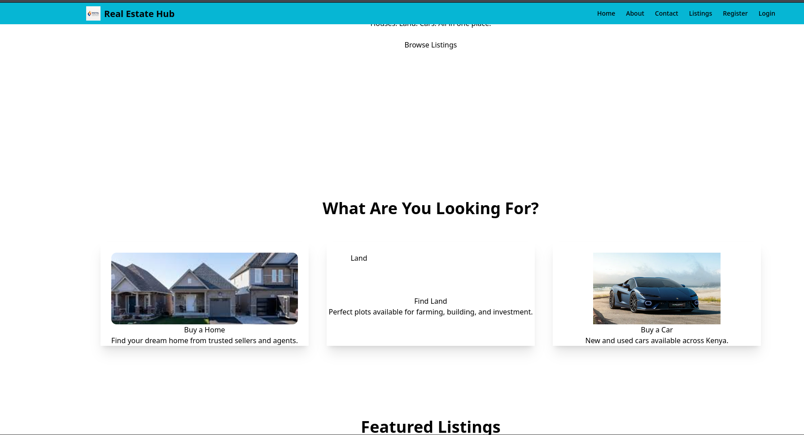
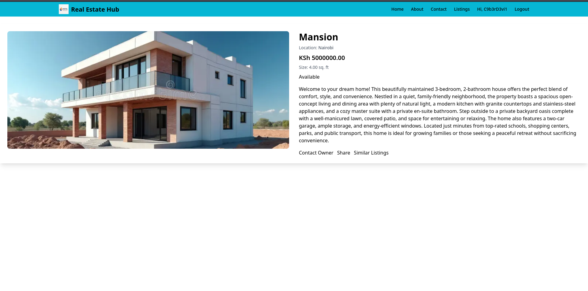

# realestate-hub

A web app for selling land, housing, plots, and cars combines real estate and vehicle marketplace features

# 🏠 Real Estate Hub

A modern web application for listing, viewing, and managing real estate properties — including **houses**, **cars**, and **land**. Built with **Django** on the backend and styled using **TailwindCSS** and **DaisyUI** for a beautiful and responsive frontend experience.

---

## 🚀 Features

- 🔍 Browse listings for houses, cars, and land
- 📄 View detailed property pages with images, prices, and contact buttons
- 📝 Add, edit, and manage listings (admin interface)
- 📱 Fully responsive with mobile-friendly UI
- 🎨 Clean, minimal design using TailwindCSS & DaisyUI
- 📤 Share listings and contact sellers directly

---

## 🖼️ Screenshots





---

## 🛠️ Tech Stack

| Layer         | Technology           |
|---------------|----------------------|
| Backend       | Django, Python       |
| Frontend      | TailwindCSS, DaisyUI |
| Templates     | Django Templates     |
| Database      | SQLite (default)     |
| Deployment    | Docker / cPanel / Heroku |

---

## 📁 Project Structure

    realestate-hub/
    ├── listings/ # App for houses, cars, land
    │ ├── models.py # House, Car, Land models
    │ ├── views.py # Detail and listing views
    │ ├── urls.py # URL routes
    │ ├── templates/
    │ │ └── listings/ # HTML templates
    ├── static/ # CSS, JS, images
    ├── media/ # Uploaded images
    ├── realestate-hub/ # Project config
    ├── db.sqlite3 # Database
    └── manage.py
    

---

## ⚙️ Installation

1. **Clone the repository**
   ```bash
   git clone https://github.com/C9b3rD3vi1/realestate-hub.git
   
   cd realestate-hub
   ```
2. **Create a virtual environment**
   ```bash
   python3 -m venv env
   
   source env/bin/activate
   ```
   
3. **Install dependencies**
   ```bash
   pip install -r requirements.txt
   ```
4. **Run migrations**
   ```bash
   python manage.py makemigrations
   
   python manage.py migrate
   ```
   
5. **Create a superuser**
   
   ```bash
   python manage.py createsuperuser
   ```
   
6. **Start the development server**
   ```bash
   python manage.py runserver
   ```
   
7. **Access the application**
   Open your browser and navigate to `http://localhost:8000` to view the application.


✨ Todo / Future Improvements
 Search & filtering by location, price, etc.

 Add user registration & authentication

 Add image galleries for listings

 REST API for frontend frameworks or mobile apps

 Unit and integration tests


🤝 Contributing
Pull requests are welcome! For major changes, open an issue first to discuss what you'd like to change.


📄 License

MIT License

🙋‍♂️ Author

Developed by C9b3rD3vi1


Feel free to reach out with feedback or contributions!

